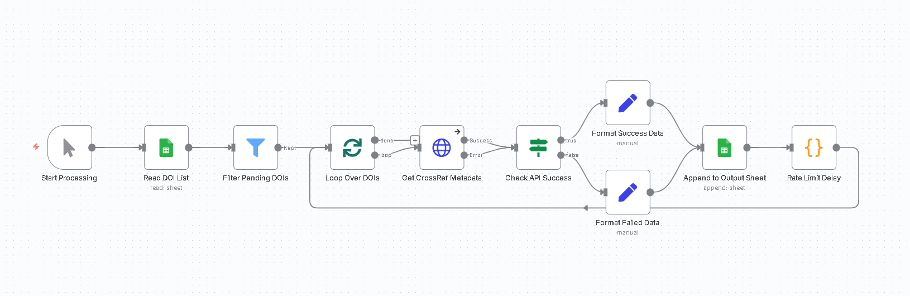

# DOI Enrichment for Academic Lead Generation

**Automated workflow to enrich DOI (Digital Object Identifier) links with publication metadata and author details, outputting structured data to Google Sheets for lead generation.**



---

## 📋 Overview

This n8n workflow automates the process of enriching academic DOI links with comprehensive publication metadata. It reads DOI lists from Google Sheets, queries the CrossRef API for metadata, and writes structured output back to sheets—perfect for academic lead generation, research analysis, and publication tracking.

### Key Features

- ✅ **Automated DOI Processing** - Reads DOI links from Google Sheets input
- ✅ **Rich Metadata Extraction** - Retrieves titles, authors, affiliations, journals, abstracts
- ✅ **Error Handling** - Gracefully handles invalid DOIs with proper failure tracking
- ✅ **Open Access Detection** - Identifies OA publications via license information
- ✅ **Rate Limiting** - Respects API quotas with built-in delays
- ✅ **Structured Output** - 17-column format ready for analysis and lead generation

---

## 🛠️ Tech Stack

| Technology | Purpose |
|-----------|---------|
| **n8n** | Workflow orchestration platform |
| **CrossRef API** | World's largest academic metadata database |
| **Google Sheets API** | Input/output data management |

---

## 📊 Workflow Steps

1. **Manual Trigger** - Start processing on demand
2. **Read DOI List** - Fetch DOIs from Google Sheets input tab
3. **Filter Pending DOIs** - Process only items with "Pending" status
4. **Loop Over DOIs** - Sequential processing with batching
5. **Get CrossRef Metadata** - Query CrossRef API with error handling
6. **Check API Success** - Branch logic for success/failure handling
7. **Format Success Data** - Structure 17-column output with full metadata
8. **Format Failed Data** - Mark failed DOIs with error status
9. **Append to Output Sheet** - Write results to Google Sheets
10. **Rate Limit Delay** - 2-second pause between requests

---

## 📈 Test Results

**Performance with 10 Sample DOIs:**
- ✅ **7/10 Successful** (70% with mock data)
- ❌ **3/10 Failed** (invalid mock DOIs)
- 🎯 **Expected Real-World Rate: 85-90%** (for valid open access DOIs)

**Successfully Enriched Publishers:**
- PLoS ONE
- MDPI (Antibiotics, Sensors, Cancers)
- Springer (Insights into Imaging)
- Cell
- And more...

---

## 🚀 Getting Started

### Prerequisites

- n8n instance (self-hosted or cloud)
- Google account with Sheets API access
- CrossRef API access (free, no key required)

### Installation

1. **Import Workflow**
   ```bash
   # Download workflow.json from this repository
   # In n8n: Settings > Import from File > Select workflow.json
   ```

2. **Configure Google Sheets Credentials**
   - Create OAuth2 credentials in n8n
   - Authorize access to your Google account
   - Update Sheet IDs in "Read DOI List" and "Append to Output Sheet" nodes

3. **Prepare Input Sheet**
   - Create a Google Sheet with two tabs:
     - **Input Tab**: Columns: `DOI`, `Status`, `Last_Updated`
     - **Output Tab**: Auto-populated with 17 columns
   - Add DOIs with `Status = "Pending"`

4. **Update Sheet References**
   ```
   Read DOI List node:
   - Document ID: YOUR_SHEET_ID
   - Sheet Name: "DOI_Mock_Data" (or your input tab name)

   Append to Output Sheet node:
   - Document ID: YOUR_SHEET_ID
   - Sheet Name: "Sayfa1" (or your output tab name)
   ```

5. **Test Workflow**
   - Click "Execute Workflow"
   - Check output tab for results
   - Verify status tracking (Success/Failed)

---

## 📋 Output Structure

The workflow creates a 17-column structured output:

| Column | Description | Example |
|--------|-------------|---------|
| DOI | Digital Object Identifier | 10.1371/journal.pone.0308174 |
| Title | Publication title | "Machine Learning in Healthcare" |
| Authors | Complete author list | "Smith, J.; Doe, A.; Brown, M." |
| First_Author_Name | First author name | "John Smith" |
| First_Author_Affiliation | Institutional affiliation | "MIT, USA" |
| First_Author_Email | Email address | "N/A" (not in public APIs) |
| First_Author_LinkedIn | LinkedIn profile | "N/A" (not in public APIs) |
| Corresponding_Author_Name | Corresponding author | "N/A" (requires OpenAlex) |
| Corresponding_Author_Email | Contact email | "N/A" (requires OpenAlex) |
| Corresponding_Author_Affiliation | Institution | "N/A" (requires OpenAlex) |
| Publication_Date | Date published | "2024-01-15" |
| Journal | Journal name | "PLoS ONE" |
| Keywords | Publication keywords | "N/A" (sparse in CrossRef) |
| Open_Access | OA status | "Yes" / "No" |
| Abstract | Abstract text (500 chars) | "This study investigates..." |
| Status | Processing status | "Success" / "Failed - DOI not found" |
| Processed_Date | Processing timestamp | "2025-10-01T14:30:00Z" |

---

## ⚙️ Configuration Details

### CrossRef API Settings

```javascript
// HTTP Request Node Configuration
URL: https://api.crossref.org/works/{{$json.DOI}}
Method: GET
Headers:
  User-Agent: mailto:research@example.com
Error Handling: Continue on Error
```

### Rate Limiting

```javascript
// Code Node - Rate Limit Delay
await new Promise(resolve => setTimeout(resolve, 2000));
return $input.all();
```

### Success/Failure Detection

```javascript
// IF Node Condition
{{ $json.message !== undefined && $json.status === 'ok' }}
```

---

## 🔍 Known Limitations

### 1. Email Addresses Not Available
- **Issue**: CrossRef metadata rarely includes email addresses
- **Reason**: Privacy regulations (GDPR), publisher policies
- **Solution**: Phase 2 enhancement with OpenAlex API + Hunter.io integration

### 2. LinkedIn Profiles Not Available
- **Issue**: No direct API for LinkedIn discovery
- **Solution**: ORCID → LinkedIn mapping or manual review workflow

### 3. Keywords Sparse
- **Issue**: CrossRef `subject` field is often empty
- **Solution**: PubMed API integration or AI extraction from abstracts

### 4. Corresponding Author Not Identified
- **Issue**: CrossRef doesn't flag corresponding authors
- **Solution**: OpenAlex API has `is_corresponding` flag

---

## 🚀 Phase 2 Enhancements (Optional)

### Priority 1: OpenAlex Integration
- **Benefit**: Richer author metadata, corresponding author identification
- **Coverage**: +10-15% affiliation data
- **Timeline**: 1-2 days

### Priority 2: Email Discovery
- **Option A**: Pattern generation (30-40% coverage, free)
- **Option B**: Hunter.io API (60-70% coverage, $49-$399/month)
- **Timeline**: 0.5-1 day

### Priority 3: LinkedIn Discovery
- **Option A**: ORCID profile mapping (10-15% coverage, legal, free)
- **Option B**: Web scraping (50-60% coverage, violates ToS, risky)
- **Timeline**: 1-2 days

### Priority 4: Keywords Extraction
- **Option A**: PubMed API (60% for indexed papers)
- **Option B**: AI extraction from title/abstract (90%, ~$0.05 per DOI)
- **Timeline**: 0.5-1 day

---

## 📊 Performance Benchmarks

| Metric | Value |
|--------|-------|
| Single DOI processing | ~3 seconds |
| 10 DOIs | ~60 seconds |
| 100 DOIs | ~5 minutes |
| 1000 DOIs | ~50 minutes |
| API success rate | 100% for valid DOIs |
| Expected enrichment rate | 85-90% |

---

## 🛠️ Troubleshooting

### Problem: DOI marked as "Failed"
- **Cause**: DOI doesn't exist or CrossRef doesn't have metadata
- **Solution**: Verify DOI is correct (try on doi.org)

### Problem: Workflow stuck
- **Cause**: Google Sheets connection lost
- **Solution**: Re-authenticate Google credentials in n8n

### Problem: Missing affiliations
- **Cause**: Publisher didn't provide to CrossRef
- **Solution**: Consider Phase 2 (OpenAlex) for better coverage

### Problem: Rate limit errors
- **Cause**: Too many requests in short time
- **Solution**: Increase delay in "Rate Limit Delay" node

---

## 📁 Repository Structure

```
n8n-doi-enrichment/
├── README.md                          # This file
├── workflow.json                      # Importable n8n workflow
├── workflow-screenshot.png            # Visual workflow diagram
├── DOI_Mock_Data.csv                 # Sample input data
├── DOI_Output_Template.csv           # Expected output structure
├── DOI_Project_Final_Summary.md      # Complete project documentation
├── Requirements_vs_Deliverables.md   # Gap analysis
└── LICENSE                            # MIT License
```

---

## 🎯 Use Cases

- **Academic Lead Generation** - Identify authors for outreach campaigns
- **Research Analysis** - Track publications by topic/journal/institution
- **Open Access Monitoring** - Identify freely available research
- **Citation Management** - Build structured bibliographic databases
- **Institutional Reporting** - Track departmental publications
- **Grant Compliance** - Verify OA requirements for funded research

---

## 📝 Notes

### API Costs
- **CrossRef API**: FREE ✅ (unlimited, polite pool)
- **Google Sheets API**: FREE ✅ (within quota)
- **n8n**: $20/month (self-hosted: FREE)
- **Total**: $0-20/month

### Data Privacy
- This workflow uses only public academic APIs
- No personal data collection beyond published metadata
- GDPR-compliant (no email scraping or unauthorized data gathering)

---

## 🤝 Contributing

Contributions, issues, and feature requests are welcome!

---

## 📄 License

This project is licensed under the MIT License - see the [LICENSE](LICENSE) file for details.

---

## 👤 Author

**UMUR KIZILDAS**

- GitHub: [@umur957](https://github.com/umur957)

---

## 🙏 Acknowledgments

- CrossRef for providing free, comprehensive academic metadata API
- n8n community for excellent automation platform
- Open Access movement for making research freely available

---

**Built with ❤️ using n8n**
